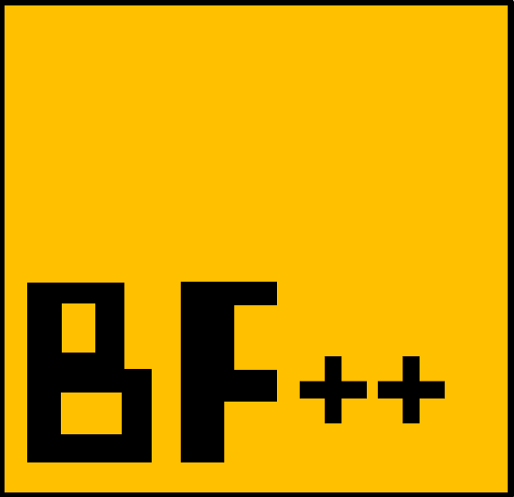

<p align="center">
  
</p>

# Brainfuck Interpreter BF++ (Extended Version)

BF++ A simple yet powerful Brainfuck interpreter written in C with extended syntax support for readability and usability.

---

## 🚀 Features

- ✅ Supports standard Brainfuck instructions: `><+-.[]`
- ➕ **Repeat modifiers**: Use `>12`, `<5`, `+3`, `-99` instead of repeating the same operator
- 🔁 **Flexible loop brackets**: Use any of `[]`, `{}`, or `()` for loops
- 📝 **Inline comments**: Start a comment with `#`, anything after is ignored until the end of the line
- 📝 **Multi-line comments**: using `'` to start the comment and `'` to end it 
- random number generation using `?` operator

---

## 📦 Build Instructions

Make sure you have `gcc` installed. Then run:

```bash
make
```

To clean the build:

```bash
make clean
```

To run a sample file:

```bash
make run
```

---

## 🧪 Example

```brainfuck
+5>3+10<2- Move pointer, increase values, and comment
{->.<}     Loop using curly braces
```

---

## 📁 Project Structure

\`\`\`text
.
├── main.c         # The interpreter source code
├── Makefile       # Build instructions
└── test.bf        # Sample Brainfuck program

\`\`\`

---

## 🛠️ Usage

You can also run the interpreter manually:

```bash
./bf your_program.bf
```

---

## 🧠 What is Brainfuck?

[Brainfuck](https://en.wikipedia.org/wiki/Brainfuck) is an esoteric programming language with only eight instructions and minimal syntax. This project extends Brainfuck with optional improvements for ease of development while staying true to its minimalism.

---

## 📜 License

This project is open source and available under the MIT License.
---

## 🧾 Command Table

| Symbol | Description                             | Notes                                             |
|--------|-----------------------------------------|---------------------------------------------------|
| `>`    | Move the pointer to the right reset to start if reaching the end of the tape         | Supports `>N` for N steps                         |
| `<`    | Move the pointer to the left going to the end of the tape if less than zero           | Supports `<N` for N steps                         |
| `+`    | Increment the value at the pointer      | Supports `+N` for N increments                    |
| `-`    | Decrement the value at the pointer      | Supports `-N` for N decrements                    |
| `.`    | Output the ASCII character at pointer   |                                                   |
| `*`    | Input a single character                |                                                   |
| `[ ]`  | Begin/end a loop                        | Loops while current cell is not zero              |
| `{ }`  | Alternative loop brackets                | Equivalent to `[ ]`                               |
| `( )`  | Alternative loop brackets                | Equivalent to `[ ]`                               |
| `#`    | Start of a comment                      | Everything after `#` ignored until end of line    |
| `'`..`'`    | Multi-line comment                      | Everything between `'`..`'` ignored    |
| `?`    | Set current cell to a random value (0–255) | Added for randomness support                      |

---
